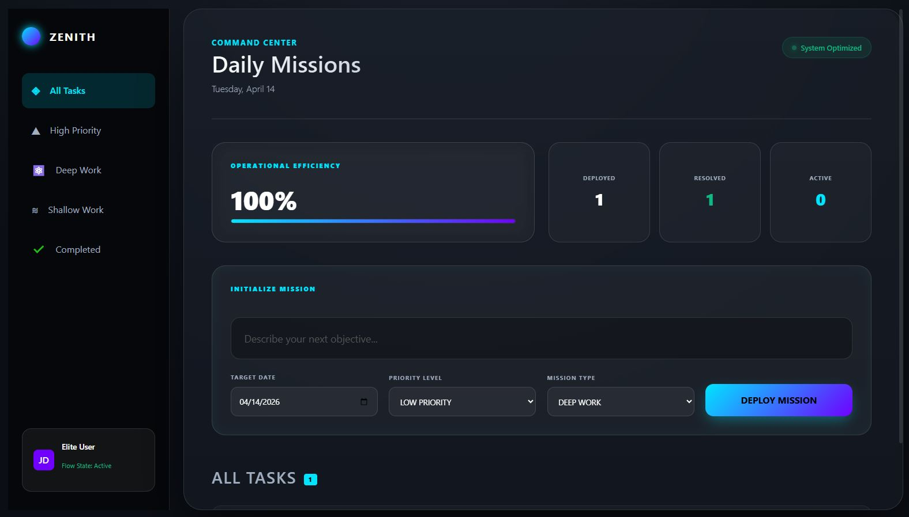

# 🌌 Zenith Mission Control

[](https://reactjs.org/)
[](https://developer.mozilla.org/en-US/docs/Web/CSS)
[](https://vitejs.dev/)
[](https://github.com/)

**Zenith Mission Control** is a professional-grade productivity ecosystem built with React. Moving beyond the traditional "Todo List," Zenith offers a futuristic mission-based dashboard designed for high-performance task management, cognitive flow tracking, and real-time operational metrics.



## 🎯 Key Features

- **🚀 Mission Dashboard**: A sleek, dark-themed "Command Center" interface with glassmorphism and high-contrast visuals.
- **📊 Operational Pulse**: Real-time productivity tracking showing operational efficiency, resolved missions, and active objectives.
- **⚡ Advanced Filtering**: Switch between "Deep Work," "High Priority," and "Completed" missions instantly via the interactive sidebar.
- **💾 Persistent Command State**: Automated data persistence using browser `LocalStorage`, ensuring your mission parameters are never lost.
- **📱 Responsive Architecture**: Optimized experience across all devices, featuring a unique adaptive nav-system for mobile users.
- **🛠️ Task Nodes**: Individual task management with priority levels (Standard Op, High Classified) and custom category labels.

## 🛠️ Tech Stack

- **Frontend**: React (v18+)
- **State Management**: React Context API & `useReducer`
- **Styling**: Vanilla CSS3 (Custom Design System with CSS Variables)
- **Icons**: Custom SVG Glyphs
- **Build Tool**: Vite

## 🚀 Getting Started

### Prerequisites

- Node.js (v16.0.0 or higher)
- npm or yarn

### Installation

1. Clone the repository:
   ```bash
   git clone https://github.com/Imtiaz-Ali17314/ZENITH-todo-app-react-project
   ```

2. Navigate to the project directory:
   ```bash
   cd ZENITH-todo-app-react-project
   ```

3. Install dependencies:
   ```bash
   npm install
   ```

4. Launch the Mission Control:
   ```bash
   npm run dev
   ```

## 📂 Project Structure

```text
src/
├── components/          # Specialized UI Modules
│   ├── MissionHeader    # System status & date
│   ├── StatsPulse       # Productivity analytics
│   ├── TaskCommand      # Mission initialization form
│   ├── MissionStream    # Task orchestration engine
│   └── Sidebar          # Navigation & Filtering logic
├── store/               # Global state & persistence
└── App.jsx              # Main dashboard assembly
```

## 🌌 The Vision

Zenith was developed as part of a **29-Day Project Showcase Journey** (Day 11). It represents the transition from basic React state management to professional-grade UI/UX engineering, focusing on immersive aesthetics and optimized cognitive performance for elite users.

---

*Designed and Engineered by Imtiaz ALi*
